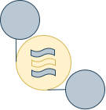

# qe-eventmanager



[](https://quay.io/repository/ariobolo/qe-eventmanager)

## Roles

The app can act as a manager handling integrations based on flow definitions, or it can act as a tool to interact within the providers configured.

### Actioner

As an actioner the cli allows to run single actions:

* Send an UMB menssage

```bash
./qe-eventmanager umb send -p providers.yaml \
                           -m message.json \
                           -d VirtualTopic.sample
```

* Create / update a repository status on github

```bash
./qe-eventmanager github status -p providers.yaml \
                           -s success \
                           -o sample-owner \
                           --repo sample-repo \
                           --ref SHA_COMMIT 
```

### Manager

As a manager integrate providers based on flow definitnions:

```bash
./qe-eventmanager start -p providers.yaml \
                        -f flow1.yaml,flow2.yaml
```

A simple overview on an umb-tekton integration


## Configuration

The eventmanager requires a set of information around the `providers` on which it can act upon  
and a set or `flows` defining the integrations and the actions to be executed.  

### Providers

```yaml
umb:
  consumerID: foo
  driver: amqp
  brokers: broker1:5556,broker2:5556
  userCertificate: XXXXXXX # encoded as base64
  userKey: XXXXX # encoded as base64
  certificateAuthority: XXXXXX # encoded as base64
tekton:
  namespace: myNamespace
  workspaces:
  - name: workspace1
    pvc: pvc1
  - name: workspace2
    pvc: pvc2
  kubeconfig: XXXXXX # encoded as base64. This value is optional is used to connect to remote cluster
                     # Otherwise eventmanager can rely on RBAC when running inside the cluster
github: # Can be configured to auth based on pat or as a github app, bot require read public repos and read-write status rights 
  token: github_pat_token 
  appID: 1 
  appInstallationID: 99
  appKey: XXXXXX # encoded as base64
```

### Flows  

```yaml
name:  sample-flow
input:
  umb:
    topic: topic-to-consume
    filters:
      - $.node1.node2[?(@.field1=='value1')].field1
      - $.node1.node2[?(@.field2=='value2')].field1
action:
  tektonPipeline:
    name: XXX
    params:
    - name: foo
      value: $.node1.node2[(@.field=='foo')].id # $. jsonpath expression function
    - name: bar
      value: bar # constant string 
  success:
    umb:
      topic: topic-to-produce
      eventSchema: message-schema-to-send
      eventFields:
      - name: foo
        value: $(pipeline.results.result1) # Pick value from pipeline results result1 
      - name: bar
        value: bar # constant string
  error:
    github:
      status:
        commit: $.node1.node2.sha
        owner: sample-owner
        repo: sample-repo # Configured github providers require rights on this repo
        status: error
```

## Build

### Cli

```bash
make clean
make build
```

### Container

```bash
make container-build
```